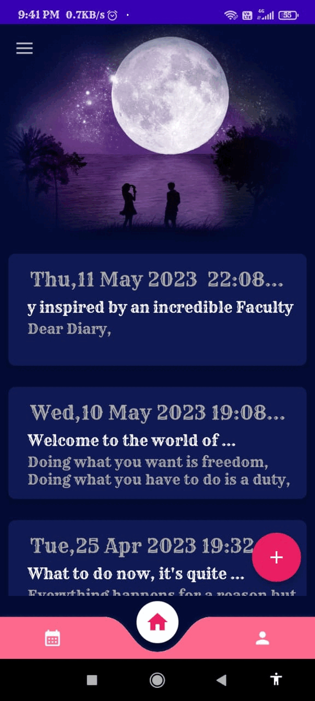

# 📘 MyMemoir – Personal Journal App

**MyMemoir** is a minimalist and secure Android application designed to help users document and reflect on their thoughts, memories, and life experiences. Built with a focus on privacy and simplicity, it serves as a digital diary offering personal expression in a clutter-free environment.

---

## 🚀 Features

### 📝 Journal with Ease
- **Create & Manage Entries** — Add, edit, or delete diary entries effortlessly.
- **Timestamps** — Entries are automatically saved with the current date and time.

### 🎨 Customization & Themes
- **Theme Options** — Personalize the look and feel with multiple visual themes.
- **Awesome UI** — Clean and distraction-free interface for better writing focus.

### 🔒 Privacy & Security
- **Password Protection** — Lock your journal with a password authentication for quick and secure access.
- **Offline-First** — Your data stays on your device with no need for internet connectivity.

---

## 🛠 Tech Stack

- **Android Studio** – IDE used for Android development  
- **Java** – Core programming language  
- **XML** – UI design and layout creation  
- **SQLite** – Local database for storing diary entries securely  

---

## 💡 Use Case

Whether it’s to track personal growth, relieve stress, or simply jot down moments worth remembering, **MyMemoir** offers a safe and intuitive space to preserve your private thoughts — anytime, anywhere.

---

## 📲 Screenshots / Demo

> 🖼️ You can see the demo [here](https://i.ibb.co/fwB81gG/MyMemoir.gif):
> 

---

## 🤝 Contributing

Have ideas or want to improve the app?  
Feel free to fork the repository, create a new branch, and submit a pull request!

---

## 📄 License

This project is licensed under the [MIT License](LICENSE).

---

## 🌐 Contact

For feedback, suggestions, or collaboration:  
📧 diwakar.allu.3435@gmail.com
🔗 [LinkedIn](https://www.linkedin.com/in/alludiwakar3435/)

---
